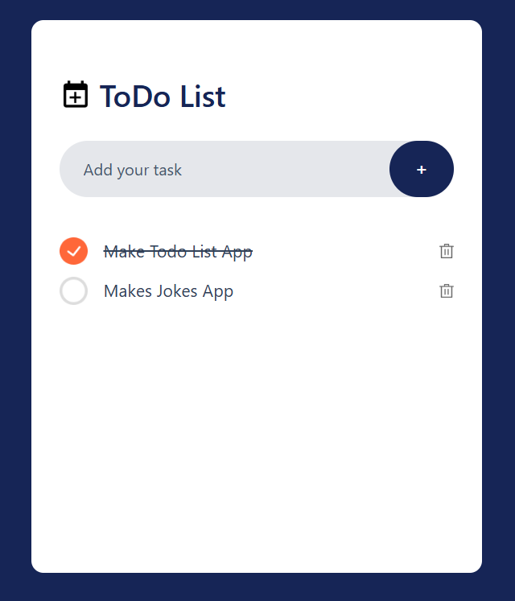

# 📝 Todo List App

A minimal and responsive Todo List application built using **React** and **Tailwind CSS**. This project showcases component-based architecture, modern UI design, and interactive state management in React.

## 🚀 Features

- ✅ Add and delete todos
- 📋 Mark tasks as completed
- 💾 Local storage persistence
- 📱 Responsive design using Tailwind CSS

## 🛠️ Tech Stack

- [React](https://reactjs.org/)
- [Tailwind CSS](https://tailwindcss.com/)
- [Vite](https://vitejs.dev/)

## 📸 Screenshots

## 🧪 Testing
No formal tests added. You can add unit tests using tools like Vitest or React Testing Library.

## ✨ Future Improvements
- Drag & drop support
- Due dates & reminders
- User authentication